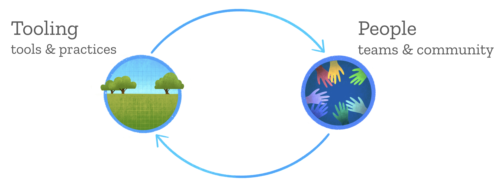
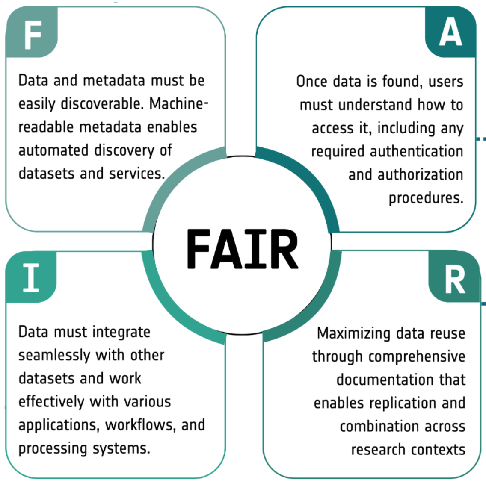
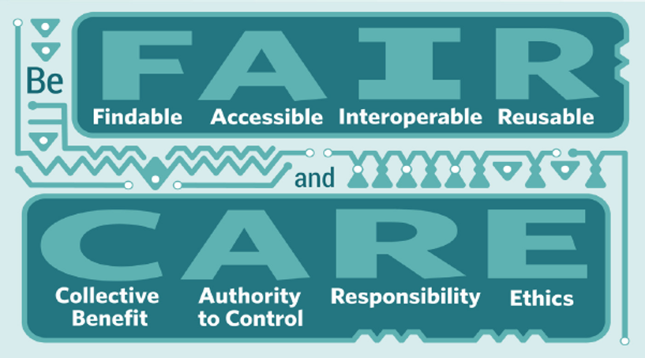
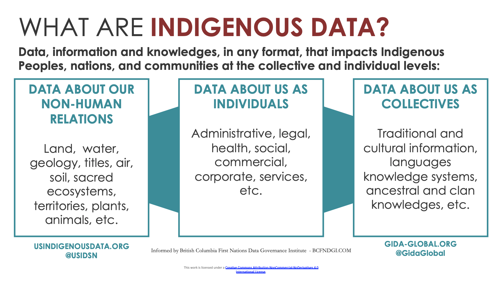
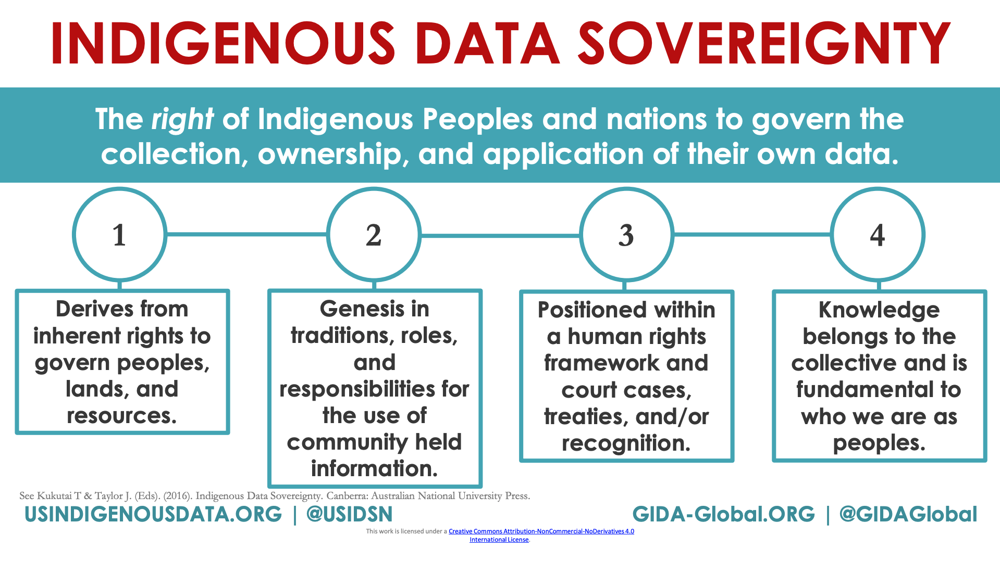
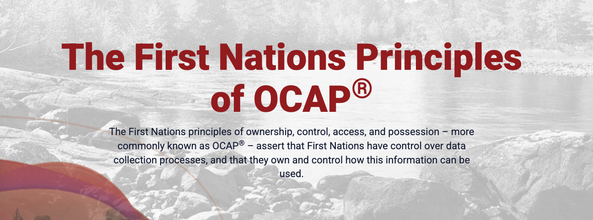

## What is Open Science

> The principles of open science are to make ... scientific research
> transparent, available, and reproducible.\
> - **NASA Open Science**

- [Open Data]{.fragment .bold-in fragment-index=1}
- [Open Source tools]{.fragment .bold-in fragment-index=1}
- [Open Code]{.fragment .bold-in fragment-index=1}
- Open Access publications

[**Reproducibility**]{.color-yellow .fragment fragment-index=1 style="font-weight: bold; font-size: 1.5em;"}

::: notes
- Reproducibility is the key
- Not just for peers and the scientific community, but important for
  collaboration
- You will always have at least one collaborator - your future self
:::

## Open Data Science

[**The tooling and people enabling reproducible, transparent, and inclusive
practices for data-intensive science**]{.small}



::: notes
**A beautiful feedback loop:** Using similar tooling promotes and streamlines
teamwork. And teamwork better equips you to learn new tooling. With this shared
mindset, the idea of team becomes ever-broadening, along with your abilities to
adapt to an evolving softwarescape.
:::

# Open Data

## FAIR Principles

::: {.columns}
::::: {.column width="40%"}
- **F**indable
- **A**ccessible
- **I**nteroperable
- **R**eusable
:::::

::::: {.column width="60%"}
{height="500px"} :
:::::
:::

<https://www.nature.com/articles/sdata201618>

## CARE Principles



<https://www.gida-global.org/careprinciples>

::: notes
emphasis on greater data sharing creates a tension for Indigenous Peoples who
are also asserting greater control over the application and use of Indigenous
data and Indigenous Knowledge for collective benefit.

- FAIR is mostly about how data is managed and stored, while CARE is about how
  data is used and shared with respect to Indigenous Peoples.

- **Collective Benefit** Data ecosystems shall be designed and function in ways that
enable Indigenous Peoples to derive benefit from the data.

- **Authority** to Control Indigenous Peoples' rights and interests in Indigenous data
must be recognised and their authority to control such data be empowered. 

- Enables Indigenous Peoples and governing bodies to
determine how Indigenous Peoples, as well as Indigenous lands, territories,
resources, knowledge, are represented and identified within data.

- *Responsibility* Those working with Indigenous data have a responsibility to share
how those data are used to support Indigenous Peoples' self determination and
collective benefit. Accountability requires meaningful and openly available
evidence of these efforts and the benefits accruing to Indigenous Peoples.

- *Ethics* Indigenous Peoples' rights and wellbeing should be the primary concern at
all stages of the data life cycle and across the data ecosystem.
:::

--------------------------------------------------------------------------------



[Reused under CC-BY 4.0 license, from
https://www.gida-global.org/careprinciples](https://static1.squarespace.com/static/5d3799de845604000199cd24/t/640792a43ba5c11a1073bbc8/1678217895508/TheCAREPrinciples.pdf){.small}

--------------------------------------------------------------------------------



[Reused under CC-BY 4.0 license, from
https://www.gida-global.org/careprinciples](https://static1.squarespace.com/static/5d3799de845604000199cd24/t/640792a43ba5c11a1073bbc8/1678217895508/TheCAREPrinciples.pdf){.small}

## FNIGC in Canada



<https://fnigc.ca/ocap-training/>

::: notes
- FNIGC is the First Nations Information Governance Centre
- Ownership, Control, Access, and Possession (OCAP) is a set of standards that
  establish how First Nations data should be collected, protected, used, or
  shared.
- Course - Fundamentals of OCAP
:::

# Open Source Tools

::: {.columns}
::::: {.column width="40%"}
{height="300px" fig-align="center"}
:::::

::::: {.column width="60%"}
{height="200px" fig-align="center"}
:::::
:::

{height="200px" fig-align="center"}

::: notes
- if you use proprietary software, you are not able to share your code and
  workflows with others and they won't be able to run it without purchasing the
  software
- R and Python are the most popular programming languages for data science and
  scientific computing
- Julia is a newer programming language that is gaining popularity in the
  scientific computing community
:::

## Code: Thinking for Reuse

- Often we are (or think we are) only doing our data work on our own
- When we want to facilitate collaboration or focus on reproducibility, we need new strategies:
  - Project organization
  - File naming conventions and file path specification
  - Communication methods

## Prerequisite: Save code in scripts

**Saving code is an absolute requirement for reproducibility. (Future you,
future us)**

- Save commands as scripts (`.R`/`.py`) or notebooks (`.qmd`/`.ipynb`).

- It doesn't have to be polished.

- Just save it!

- Everything that really matters should be achieved through code that you save

- Contrast: Series of unrecorded mouse clicks

The **process** is important, the **product** is just an outcome

- Outputs should be treated as disposable
- Scripts are the source of truth

## Adopt a project-oriented workflow

<br>

::: columns
::::: {.column width="48%"}
### Why

- You *and your code* can find all parts of your project

- collaborate, communicate, distribute
:::::

::::: {.column width="4%"}
:::::

::::: {.column .fragment width="48%"}
### How

- Single dedicated directory

- RStudio Project or VSCode Workspace

- Git repo, probably syncing to a remote
:::::
:::

## Organize your work into projects

One folder per project.

- Report? Analysis? Notebook? Website? Whatever.

- Can be the same unit as a GitHub Repo.

- All paths are relative to the project's folder.

## What does it mean to work in a Project?

- dedicated **R** or **Python** process running in Project directory
- IDE's file browser pointed at Project directory
- working directory set to Project directory

. . .

<br>

Often just a project folder that's been opened in its own window via *Open
Folder* or similar

## Intentionally Choose a Project Structure

```{.file-tree}
foofy/
├── pyproject.toml
├── pixi.lock
├── README.md
├── LICENSE.md
├── foofy-paper.qmd
├── data/
│   ├── raw/
│   │   └── raw_foofy_data.csv
│   └── processed/
│       └── foofy_clean.csv
├── src/
│   └── foofy/
│       ├── get-data.py
│       ├── clean.py
│       └── plotting.py
├── notebooks/
│   └── explore.ipynb
└── figs/
    └── fig.png
```

::: notes
- Everything the project needs lives under one root folder -- `foofy/` -- so it
  can be zipped, cloned, or opened by anyone and just work.
- Structure is up to you, but try to be consistent so you and collaborators
  are familiar and know how things are organized.
- `pyproject.toml` (or `requirements.txt`) records dependencies; opening this
  folder is enough to know what's needed to run it.
- `data/raw` is treated as read-only input; `data/processed` holds derived
  outputs -- keeping them separate makes it clear what can be regenerated.
- `src/foofy` holds importable code (functions), while `notebooks/` holds
  exploratory/narrative work that calls into it.
- All paths in code are relative to this root
:::

## Practice "safe paths" in your code

The chance of `setwd()` (or `os.chdir()`), or reading/writing from/to an 
absolute path, having the desired effect -- making the file paths work -- for 
anyone besides its author is **`~0%`**.

::: panel-tabset
### R

```r
setwd("C:\\Users\\andy\\cuddly_broccoli\\verbose\\foofy\\data")
df <- read.csv(“raw_foofy_data.csv”)
p <- ggplot(df, aes(x, y)) + geom_point()
ggsave("C:\\Users\\andy\\cuddly_broccoli\\ambiguous\\fig.png")
```

### Python

```python
os.chdir("/Users/andy/cuddly_broccoli/verbose/foofy/data")
df = pd.read_csv("raw_foofy_data.csv")
df.plot(x="x", y="y", kind="scatter")
plt.savefig("/Users/andy/cuddly_broccoi/ambiguous/fig.png")
```
:::

. . .

It's also unlikely to work for the author one or two years or computers
from now.

Hard-wired, absolute paths, especially when sprinkled throughout the code, make
a project brittle. Such code does not travel well across time or space.

## Practice "safe paths"

- Work in a project and use relative paths
- Relative to a **stable base**, not **absolute paths**.
- Use **file system functions**, not `paste()`, etc.

. . .

### R

```{r}
#| eval: false
#| echo: true
data_path <- file.path("data", "my_data.csv")

my_data <- read.csv(data_path)
```

### Python

```python
from pathlib import Path

my_data = pd.read_csv(Path("data") / "my_data.csv")
```

::: notes
- It anchors the editor to a specific project folder as the root --- relative
  paths in scripts resolve consistently no matter who opens the project or from
  where.
- It pairs naturally with a git repo

- never rely on a global/absolute-path setup that only works on your machine. The
project root becomes the one fixed reference point, so the project runs
identically for a collaborator or your future self.
:::

# Version Control

## {background-image="img/why-github.png"}

::: notes
- Git is the tool that tracks history locally; a **remote** (GitHub, GitLab,
  Codeberg, ...) is what turns that into backup + collaboration.
- Contrast with "final_v2_reallyfinal.R" style versioning by filename -- Git
  replaces that with real history you can diff, branch, and revert.
:::

## {background-image="img/commits.png" background-size="contain"}

::: notes
- having files named with `_v1`, `_v2`, `_final`, etc. is a barrier to
collaboration and reproducibility because it becomes hard to know what you did.
- Version control helps prevent that
:::
## README.md

**The first thing a human (including future you) sees when they open the
repo.**

- What is this project, and why does it exist?
- How do I install/set it up and run it?
- How do I cite it, or who do I contact with questions?

Treat it as living documentation -- update it as the project evolves.

::: notes
- Minimal useful structure: Title, Description, Installation, Usage,
  License, Contact/Citation.
- A stranger should be able to land on the repo and know what it does and how
  to get started within a minute or two.
:::

## LICENSE.md

> By default, a GitHub repo without an open source licence applied to it is
> **not open source** (All Rights Reserved).

- MIT is a good, permissive license for most projects
- Apache 2.0 is similar, but adds an explicit patent grant

. . .

#### Work Projects

```{.black-code}
Copyright (c) 2026 His Majesty the King in Right of Canada, as represented by the Minister responsible for Fisheries and Oceans Canada
```

#### Personal projects

```{.black-code}
Copyright (c) 2026 Andy Teucher
```

## Other important files

### CONTRIBUTING.md

### CODE_OF_CONDUCT.md

# Dependency Management

## Why manage dependencies?

- Code depends on specific packages -- **and specific versions** of them

- "Works on my machine" isn't reproducible

- A **lockfile** records the exact environment (packages + versions) so it can
  be recreated on another machine, months or years later

- Goal: one command to install/restore the *exact* environment a project needs

::: notes
- Package APIs and behaviour change over time; a script that
  works today may silently break (or silently give different results) after an
  update.
- The lockfile is what gets committed to the repo, not the packages
  themselves -- it's small, diffable, and versioned alongside the code.
:::

## `renv` (R) and `pixi` (Python)

Both create a **project-local** environment and a lockfile you commit to
the repo.

::: panel-tabset
### R (`renv`)

```r
renv::init()      # start using renv in this project
renv::snapshot()  # record package versions -> renv.lock
renv::restore()   # reinstall exact versions from renv.lock
```

Produces `renv.lock` + a project-local `renv/library`.

### Python (`pixi`)

```bash
pixi init              # creates pixi.toml
pixi add numpy pandas  # add deps -> updates pixi.lock
pixi install           # install environment according to pixi.lock
```

Produces `pixi.toml` + `pixi.lock`.
:::

::: notes
- Collaborators (or your future self) run one restore/install command instead
  of manually reinstalling packages and hoping for the same versions.
- `pixi` also manages the Python interpreter version itself (via conda-forge),
  similar to how `renv` can pin the R version.
:::

# Reproducible Reporting

Research is considered to be reproducible when the exact results can be 
reproduced if given access to the original data, software, and code.

\

. . .

If we can put our code and narrative text in a single document, it means:

::: {.incremental}

- You don't have to copy and paste figures and tables into reports
- Reports are automatically updated when data or analyses change
- Human error is reduced
- Enhanced transparency and reproducibility

:::

## {background-image="img/literate-programming.png" background-size="contain"}

## {background-image="img/quarto.png" background-size="contain"}

## {background-image="img/quarto-html.png" background-size="contain"}

## Reproducible Workflows

- ✅ Open Data (FAIR + CARE)
- ✅ Open Source Tools
- ✅ Project-oriented Workflows
- ✅ Open Code + Version Control
- ✅ Dependency management (e.g., `uv`/`pixi`/`conda`/`renv`)
- ✅ Literate Programming (Quarto, Jupyter Notebooks)
- Containerization (e.g., Docker)

Checklists: <https://github.com/oceanhackweek/ohwyy_proj_template/issues>

::: notes
Containers
- The operating system in use,
- The compiler flags used when R and packages are built,
- The LAPACK / BLAS system(s) in use,
- The versions of system libraries installed and in use,
:::

## Discussion

- What is one step you can take right now to make your work more reproducible?
- What is the biggest challenge in your work to making it more reproducible?
